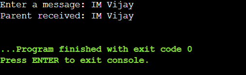

# OS-EX.6-IMPLEMENTATION-OF-INTER-PROCESS-COMMUNICATION-USING-PIPE

## AIM:
To Write C program to illustrate IPC using pipes mechanisms.

## ALGORITHM:
### Step 1:
Import the os module for process management and communication.
### Step 2:
Define a main() function as the program's entry point.
### Step 3:
Prompt the user to input a message and encode it as bytes.
### Step 4:
Create two pipes, parent_pipe and child_pipe, for communication.
### Step 5:
Fork a child process using os.fork().
### Step 6:
In the child process, close the parent's pipe end and write the message to the child's pipe end.4
### Step 7:
In the child process, close the child's pipe end.
### Step 8:
Exit the child process.
### Step 9:
In the parent process, close the child's pipe end.
### Step 10:
Read the message from the parent's pipe end, decode it, and print it.

## PROGRAM:
```
import os

def main():
    message = input("Enter a message: ").encode()
    parent_pipe, child_pipe = os.pipe()

    child_pid = os.fork()

    if child_pid == 0:
        os.close(parent_pipe)
        os.write(child_pipe, message)
        os.close(child_pipe)
        exit(0)
    else:
        os.close(child_pipe)
        received_message = os.read(parent_pipe, 100)
        os.close(parent_pipe)
        print("Parent received:", received_message.decode())

if __name__ == "__main__":
    main()


```


## OUTPUT:

## Result:
This output confirms that the parent process successfully received and printed the message sent by the child process through the pipe, demonstrating inter-process communication using pipes.


